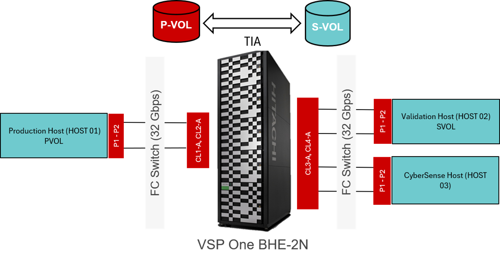

# Ansible Automation for InterSystems IRIS Application Consistency with CyberSense  and Hitachi Block Storage

Ansible automation for creating **application-consistent Thin Image Advanced (TIA) snapshots** of an **InterSystems IRIS** database with **CyberSense** running on **Red Hat Enterprise Linux (RHEL)**. The playbook validates the environment, freezes the IRIS database to ensure application consistency, creates a TIA snapshot, and initiates a **CyberSense scan** of the application-consistent snapshot to verify that the recovery copy is **clean and free from malware**. The validated recovery copy is subsequently mounted and validated on a secondary server to ensure database integrity and recoverability.

## Solution Overview

Storage Platform:		Hitachi Block Storage Systems

Database:		        InterSystems IRIS	

Operating System:		Red Hat Enterprise Linux

Snapshot Technology:	Thin Image Advanced (Cascade, CTG)

Cyber Resilience:        CyberSense

Consistency:		    Application + Filesystem Consistency

## Configuration Diagram

Below diagram depicts a standard IRIS database environment.



## Workflow

```
Environment Precheck
    │
    ▼
Application Freeze (IRIS + File System Freeze)
    │
    ▼
CyberSense Policy Trigger
    │
    ▼
Snapshot Status Check
    │
    ▼
Application Unfreeze
    │
    ▼
CyberSense Job Completion
    │
    ▼
 SVOL Mapping
    │
    ▼
Snap-on-Snap Creation
    │
    ▼
Map Snapshots & Activate VGs
    │
    ▼
Start IRIS & Validate Integrity
    │
    ▼
Cleanup
```
## Repository Structure

```text
IRIS_appln_consistency_playbook/
├── README.md                    # Project documentation
├── var.yml                      # Common variables used by all playbooks
├── main.yml                     # Executes the complete end-to-end workflow
├── precheck.yml                 # Environment validation
├── app-consistent-snapshot.yml   # Create application-consistent TIA snapshot with Cybersense 
├── snap-on-snap.yml          # Create snap-on-snap
├── mount_snapshot.yml           # Mount snapshot volumes on secondary server
├── integrity_check.yml     # Start IRIS, run user database integrity check, and perform cleanup
├── cleanup.yml         # Perform cleanup
```

## Prerequisites

•	Install Ansible collection with the Ansible Galaxy command-line tool on Ansible control node.
```
ansible-galaxy collection install hitachivantara.vspone_block
```
•	A standard variable file for storage credentials (“_ansible_vault_vars_/_ansible_vault_storage_var.yml_”) is created as shown below
```
storage_serial: <primarySerialNumber>
storage_address: <StorageManagementAddress>
vault_storage_username: <username>
vault_storage_secret: <password>
```
•	An "_inventory.ini_" file with primary and secondary server information
```
[primary]
primary-server ansible_host=172.23.x.x
[secondary]
secondary-server ansible_host=172.23.x.x
 
[all:vars]
ansible_user=root
ansible_become=yes
ansible_python_interpreter=/usr/bin/python3
```
•	InterSystems IRIS installed on both hosts (same configuration)

•	RHEL 8.x / 9.x

•	SSH connectivity to primary and secondary servers

•	REST API connectivity to the storage system

•	Thin Image Advanced licensed and configured

•	Multipath and LVM configured on both hosts

•	Cybersense installed and licensed

•	Policy already created on Cybersense prior to execution of playbook


## Environment Variables

Update the environment-specific configuration in “_var.yml_".

A typical variable file includes:

• IRIS instance

• Namespace

• Database directory

• Mount points

• Volume Groups

• Logical Volumes

• Floating snapshot mapping (Primary volume ID and Secondary volume ID)

• Cascade Snapshot Group

• Cascade  Pool ID

• Cascade Snapshot Pairs (Primary volume ID and Secondary volume ID)

• Cybersense IP

• Cybersense Login Credentials

• Cybersense Policy Name

## Execution

Run the complete workflow:
```
ansible-playbook -i inventory.ini main.yml
```
Or execute individual playbook:

```
ansible-playbook -i inventory.ini mount_snapshot.yml
```

## Logging

Execution logs are written to the Ansible log configured in "_ansible.cfg_"
```
log_path = logs/application_consistency.log
```
## Author
Hitachi Vantara Solution Engineering
