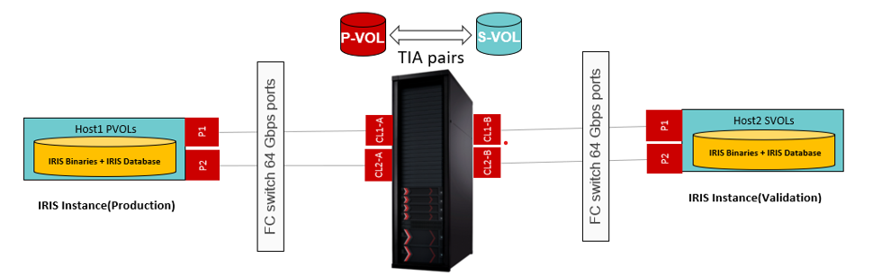

# InterSystems IRIS Application Consistency Automation With Hitachi Block Storage

Ansible automation to create **application-consistent Thin Image Advanced (TIA) Cascade snapshots** of an **InterSystems IRIS** database running on **Red Hat Enterprise Linux (RHEL)**.
The playbook validates the environment, creates an application-consistent snapshot, mounts the recovery copy on a secondary server, validates database integrity, and cleans up the snapshot environment.

## Solution Overview

Storage Platform:		Hitachi Storage Systems
Database:		        InterSystems IRIS	
Operating System:		Red Hat Enterprise Linux
Snapshot Technology:	Thin Image Advanced (Cascade, CTG)
Consistency:		    Application + Filesystem Consistency

## Configuration Diagram

Below diagram depicts a standard IRIS database environment.



## Workflow

```
Precheck
    │
    ▼
Create TIA Snapshot Pairs
    │
    ▼
Start BurstWriter Workload
    │
    ▼
Freeze IRIS + Freeze XFS
    │
    ▼
Split TIA Snapshot Pairs
    │
    ▼
Unfreeze XFS + Thaw IRIS
    │
    ▼
Mount Snapshot on Secondary Server
    │
    ▼
Start IRIS & Run Integrity Check
    │
    ▼
Stop IRIS → Unmount Snapshot → Delete Snapshot
```
## Repository Structure

```text
IRIS_appln_consistency_playbook/
├── README.md                    # Project documentation
├── ansible.cfg                  # Ansible configuration (centralized logging)
├── inventory.ini                # Inventory containing primary and secondary hosts
├── var.yml                      # Common variables used by all playbooks
├── main.yml                     # Executes the complete end-to-end workflow
├── precheck.yml                 # Environment validation
├── snapshot_create.yml          # Create application-consistent TIA snapshot
├── mount_snapshot.yml           # Mount snapshot volumes on secondary server
├── integrity_check.yml          # Start IRIS and run database integrity check
├── snapshot_delete.yml          # Stop IRIS, unmount volumes, and delete snapshots
└── ansible_vault_vars/
    └── ansible_vault_storage_var.yml   # Storage credentials
```

## Prerequisites

•	Ansible Control Node

•	Hitachi VSP One Block

•	Install Ansible collection with the Ansible Galaxy command-line tool:
```
ansible-galaxy collection install hitachivantara.vspone_block
```
•	A standard variable file for storage credentials (“_ansible_vault_storage_var.yml_”) is created as shown below:
```
storage_serial: <primarySerialNumber>
storage_address: <StorageManagementAddress>
vault_storage_username: <username>
vault_storage_secret: <password>
```
•	InterSystems IRIS installed on both hosts (same configuration)

•	RHEL 8.x / 9.x

•	SSH connectivity to primary and secondary servers

•	REST API connectivity to the storage system

•	Thin Image Advanced licensed and configured

•	Multipath and LVM configured on both hosts


## Environment Variables

Update the environment-specific configuration in: var.yml
Typical variables include:

• IRIS instance

• Namespace

• Database directory

• Mount points

• Logical Volumes

• Snapshot Group

• Snapshot Pool ID

• Mirror Unit

• Primary LDEV Range

• Secondary LDEV Range

## Execution

Run the complete workflow:
```
ansible-playbook -i inventory.ini main.yml
```
Or execute individual playbooks as required.

ansible-playbook -i inventory.ini mount_snapshot.yml

## Logging

Execution logs are written to the Ansible log configured in ansible.cfg
```
log_path = logs/application_consistency.log
```
## Author
Hitachi Vantara Solution Engineering
