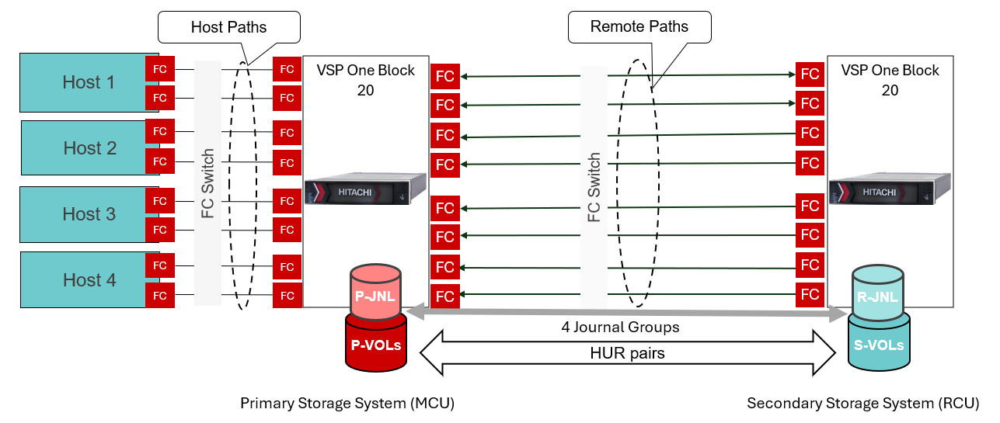

# Ansible Playbook: Create Multiple Volumes And Define Journal Groups with Copy Pace
# Overview
In Universal Replicator (UR) it is important to size the journals properly to meet the Recovery Point Objective (RPO). More journal groups deliver higher UR Initial Copy and Resync throughput because more copy operations are active simultaneously with more journal groups. This playbook can automate the creation of DP volumes, configure journal groups, and adjust the journal copy pace based on user inputs.

# Test Environment
The following diagram shows an Universal Replicator configuration with 4 journal volumes per site.


# Prerequisite

•	A standard variable file for storage credentials (“_ansible_vault_storage_var.yml_”) is created as shown below:

```
storage_serial: <primarySerialNumber>
storage_address: <StorageManagementAddress>
vault_storage_username: <username>
vault_storage_secret: <password>

secondary_storage_serial: <secondarySerialNumber>
secondary_storage_address: <StorageManagementAddress> 
vault_secondary_storage_username: <username>
vault_secondary_storage_secret: <password>
```
# Execution
Create a _var.yml_ file to define journal volume parameters such as the pool ID, number of journal volumes, starting LDEV ID for journal volume, journal volume size, start journal ID, and copy pace setting (of journal group mirrors). This playbook first create the volume then define journal with given parameter.

**Sample input for “var.yml” file:**
```
jnl_ldev_name_prefix: "JNL"
journal_ldev_config:
  storage: "MCU,RCU"
  pool_id: 2
  start_ldev_id: 1024
  count: 4
  size_gb: "100GB"
  start_journal_id: 0
  copy_pace_setting: "MEDIUM"
```
Note: The playbook will work for either MCU, RCU, or both. Options for "copy_pace_setting" are "SLOW", "MEDIUM", "FAST", default is "LOW".

Run the playbook with _ansible-playbook <playbook_name>_

This generates an output file as shown below.

**Sample Output:**
```
#cat /tmp/journal_config_report_20250914_013322.txt
===================== Journal Volume Creation Report ==================

SN: 111111
Journal ID: 0
Journal Volume IDs: 1024
  Mirror Unit IDs and Copy Pace:
      - Mirror Unit ID: 0, Copy Pace: MEDIUM
      - Mirror Unit ID: 1, Copy Pace: MEDIUM
      - Mirror Unit ID: 2, Copy Pace: MEDIUM
      - Mirror Unit ID: 3, Copy Pace: MEDIUM
...
SN: 222222
Journal ID: 3
Journal Volume IDs: 1027
  Mirror Unit IDs and Copy Pace:
      - Mirror Unit ID: 0, Copy Pace: MEDIUM
      - Mirror Unit ID: 1, Copy Pace: MEDIUM
      - Mirror Unit ID: 2, Copy Pace: MEDIUM
      - Mirror Unit ID: 3, Copy Pace: MEDIUM
