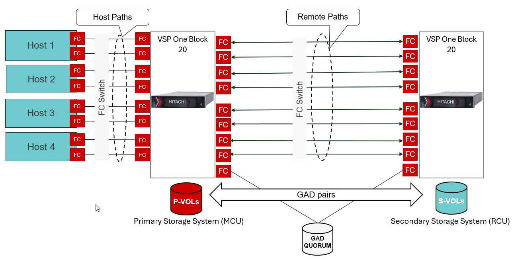

# Ansible Playbook: Bulk creation of multiple GAD pairs
# Overview
Simplify large-scale Hitachi Global Active Device (GAD) pair provisioning with Red Hat Ansible automation. In environments where hundreds of GAD pairs need to be created—such as 128 or 256 pairs, provisioning each pair individually using the "_hv_gad_" module can be both time-consuming and inefficient. To address this challenge, Hitachi Vantara Storage Automation introduces the "_hv_gad_bulk_" module, which is specifically designed for high-volume GAD pair creation. This Ansible Playbook enables batch provisioning of multiple GAD pairs based on parameters defined in a user-supplied variable file, including the number of pairs to create, start and end LDEV IDs, capacity saving settings, preconfigured host groups, and quorum assignments. During execution, the playbook dynamically applies these inputs to automate the end-to-end provisioning process, significantly reducing deployment time and simplifying large-scale disaster recovery configuration.

# Test Environment
Below diagram depicts a standard GAD configuration with 128 GAD pairs and one FC quorum device.



# Prerequisite
•	Establish Fibre Channel (FC) zoning between the two storage systems and host and primary storage system.

•	Ensure that Ansible is already configured and the local and remote VSP storage systems are registered with each other. 

•	Remote path is established between MCU and RCU (Refer to the playbook, https://github.com/hitachi-vantara/hv-playbooks-vspone-block/tree/main/create-multiple-remote-paths)

•	Host groups for P-Vols and S-Vols are already provisioned.

•	Quorum is already configured.

•	VSM is already created and S-Vols host group is added in VSM<sup>1</sup>

•	A standard variable file for storage credentials (“_ansible_vault_storage_var.yml_”) is created as shown below:

```
storage_serial: <primarySerialNumber>
storage_address: <StorageManagementAddress>
vault_storage_username: <username>
vault_storage_secret: <password>

secondary_storage_serial: <secondarySerialNumber>
secondary_storage_address: <StorageManagementAddress> 
vault_secondary_storage_username: <username>
vault_secondary_storage_secret: <password>
```

1 If you do not want to add the S-Vol host group to the VSM, specify the additional parameter "_spec.virtual_storage_serial_number_" when using the "_hv_gad_bulk_" module. The module will create the VSM and add the S-Vols and host groups to the specified VSM.

# Execution

Create a var.yml file that defines the following configuration parameters required for bulk GAD pair creation:

• Total number of P-VOLs (that is, the total number of GAD pairs to be created)

• Starting P-VOL LDEV ID

• Starting consistency group ID, i.e., CTG ID <sup>1</sup>

• Whether the S-VOL should use the same LDEV ID as the corresponding P-VOL

• Number of remote path groups

• Whether multipathing should be used for P-VOL host mappings

• Batch size (must always be set to 32 and should not be modified)

• Host groups and ports for P-VOL mappings

• Host groups and ports for S-VOL mappings

• Primary and secondary pool IDs used for provisioning volumes

• Volume size and capacity saving mode

• Quorum ID

• Base naming prefix for generated volumes

**Sample input for “var.yml” file:**
```
total_pvols: 16
start_ldev_id: 2000
start_ctg_id: 0
same_pvol_and_svol_id: "Y"
#start_svol_id: 2016
path_groups: "2,4"
multipathing: "Y"
batch_size: 32
pvol_ports:
  - CL1-A,h1
  - CL4-A,h1
  - CL5-A,h2
  - CL8-A,h2
  - CL1-D,h3
  - CL2-D,h3
  - CL3-D,h4
  - CL4-D,h4
svol_ports:
  - CL5-A,GadSvolPort
primary_pool_id: 0
secondary_pool_id: 0
volume_size: "512GB"
capacity_saving: "Compression_Deduplication"
quorum_disk_id: 0
base_name: "gad_vols"

```
Note: Number of CTG is automatically calculated based on the number of remote path groups.

Run the playbook with _ansible-playbook <playbook_name>_

Note: This playbook prompts for user confirmation before proceeding with pair creation.

```
TASK [Show batch report] ********************************************************************************************************************************************************************
ok: [localhost] => {
    "msg": [
        "PG | CTG | COPY_GROUP_NAME          | HG | PORTS                    | RANGE       | COUNT",
        "-- | --- | ------------------------ | -- | ------------------------ | ----------- | -----",
        "2  | 0   | gad_copy_group_ctg0      | h1 | CL1-A,CL4-A              | 2000-2031   | 32   ",
        "2  | 0   | gad_copy_group_ctg0      | h2 | CL5-A,CL8-A              | 2032-2063   | 32   ",
        "4  | 1   | gad_copy_group_ctg1      | h3 | CL1-D,CL2-D              | 2064-2095   | 32   ",
        "4  | 1   | gad_copy_group_ctg1      | h4 | CL3-D,CL4-D              | 2096-2127   | 32   ",
        ""
    ]
}

TASK [Confirm before execution] *************************************************************************************************************************************************************
[Confirm before execution]
Proceed with GAD bulk creation? Type 'yes' to continue, anything else to abort::


```

This generates an output file as shown below.

**Sample Output:**
```
#cat /tmp/gad_pair_report_20260519_044552.txt
Primary_Volume_ID | Secondary_Volume_ID | Consistency_Group_ID | Path_Group_ID | Primary_HGs | Secondary_HGs
----------------- | ------------------- | -------------------- | ------------- | ----------- | --------------
2000              | 2000                | 0                    | 2             | h1          | GadSvolPort
2001              | 2001                | 0                    | 2             | h1          | GadSvolPort
2002              | 2002                | 0                    | 2             | h1          | GadSvolPort
2003              | 2003                | 0                    | 2             | h1          | GadSvolPort
2004              | 2004                | 0                    | 2             | h2          | GadSvolPort
2005              | 2005                | 0                    | 2             | h2          | GadSvolPort
2006              | 2006                | 0                    | 2             | h2          | GadSvolPort
2007              | 2007                | 0                    | 2             | h2          | GadSvolPort
2008              | 2008                | 1                    | 4             | h3          | GadSvolPort
2009              | 2009                | 1                    | 4             | h3          | GadSvolPort
2010              | 2010                | 1                    | 4             | h3          | GadSvolPort
2011              | 2011                | 1                    | 4             | h3          | GadSvolPort
2012              | 2012                | 1                    | 4             | h4          | GadSvolPort
2013              | 2013                | 1                    | 4             | h4          | GadSvolPort
2014              | 2014                | 1                    | 4             | h4          | GadSvolPort
2015              | 2015                | 1                    | 4             | h4          | GadSvolPort


```
# Note
This playbook creates GAD pairs from scratch and does not support using pre-existing volumes. To create GAD pairs with existing volumes, use the "_hv_gad_" module instead.
