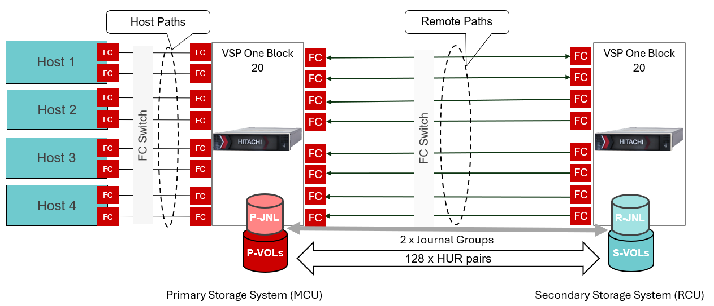

# Ansible Playbook: Bulk creation of multiple UR pairs
# Overview
Simplify large-scale Hitachi Universal Replicator (UR) pair provisioning with Red Hat Ansible automation. In environments where hundreds of HUR pairs need to be created—such as 128 or 256 pairs—provisioning each pair individually using the hv_hur module can be both time-consuming and inefficient. To address this challenge, Hitachi Vantara Automation introduces the "hv_hur_bulk" module, which is specifically designed for high-volume HUR pair creation. This Ansible Playbook enables batch provisioning of multiple HUR pairs based on parameters defined in a user-supplied variable file, including the number of pairs to create, start and end LDEV IDs, capacity saving settings, preconfigured host groups, and journal assignments. During execution, the playbook dynamically applies these inputs to automate the end-to-end provisioning process, significantly reducing deployment time and simplifying large-scale disaster recovery configuration.

# Test Environment
Below diagram depicts a standard UR configuration with 128 UR pairs and 2x Journal Groups.



# Prerequisite
•	Establish Fibre Channel (FC) zoning between the two storage systems and host and primary storage system.

•	Ensure that Ansible is already configured and the local and remote VSP storage systems are registered with each other. 

•	Remote path is established between MCU and RCU (Refer to the playbook, https://github.com/hitachi-vantara/hv-playbooks-vspone-block/tree/main/create-multiple-remote-paths)

•	Host groups for P-Vols and S-Vols are already provisioned.

•	Journals are created and copy pace set to Medium. (Refer to the playbook, https://github.com/hitachi-vantara/hv-playbooks-vspone-block/tree/main/create-HUR-journals)

•	A standard variable file for storage credentials (“_ansible_vault_storage_var.yml_”) is created as shown below:

```
storage_serial: <primarySerialNumber>
storage_address: <StorageManagementAddress>
vault_storage_username: <username>
vault_storage_secret: <password>

secondary_storage_serial: <secondarySerialNumber>
secondary_storage_address: <StorageManagementAddress> 
vault_secondary_storage_username: <username>
vault_secondary_storage_secret: <password>
```

# Execution

Create a “_var.yml_” file that defines the MCU and RCU port mappings for each remote connection. In the above diagram, for example, CL5-A from MCU connects to CL5-B of RCU in Path Group ID 0. List each pair of ports for a given path group on the same line, separated by commas. For additional path groups, add new lines as shown in the sample variable file content below. Repeat the same process for RCU paths.
specify the MCU and RCU volumes, with each line representing the volumes assigned per pool. The file also defines Adaptive Data Reduction (ADR) options ("compression", "compression_deduplication", or "disabled"), default LDEV size, a naming prefix for volumes, and whether Data Reduction Share (DRS) is enabled or disabled for MCU and RCU volumes.

**Sample input for “var.yml” file:**
```
total_pvols: 16
num_jnlgs: 2
start_jnl_id: 0
start_ldev_id: 2000
same_pvol_and_svol_id: "Y"
#start_svol_id: 2000
path_groups: "2,4"
multipathing: "Y"
batch_size: 32
pvol_ports:
  - CL1-A,h1
  - CL4-A,h1
  - CL5-A,h2
  - CL8-A,h2
  - CL1-D,h3
  - CL2-D,h3
  - CL3-D,h4
  - CL4-D,h4
svol_ports:
  - CL5-A,SvolPort
primary_pool_id: 0
secondary_pool_id: 0
volume_size: "512GB"
#capacity_saving: "Compression"
capacity_saving: "Compression_Deduplication"
base_name: "hur_vols"
data_reduction_share: true

```
Note: This playbook works with either MCU, RCU, or both path entries in “var.yml” file.

Run the playbook with _ansible-playbook <playbook_name>_
This generates an output file as shown below.

**Sample Output:**
```
#cat /tmp/hur_pair_report_20260513_012012.txt
Primary_Volume_ID | Primary_Journal_ID | Secondary_Volume_ID | Secondary_Journal_ID | Consistency_Group_ID | Path_Group_ID | Primary_HGs | Secondary_HGs
----------------- | ------------------ | ------------------- | -------------------- | -------------------- | ------------- | ----------- | --------------
2000              | 0                  | 2000                | 0                    | 0                    | 2             | h1          | SvolPort
2003              | 0                  | 2003                | 0                    | 0                    | 2             | h1          | SvolPort
2002              | 0                  | 2002                | 0                    | 0                    | 2             | h1          | SvolPort
2001              | 0                  | 2001                | 0                    | 0                    | 2             | h1          | SvolPort
2004              | 0                  | 2004                | 0                    | 0                    | 2             | h2          | SvolPort
2006              | 0                  | 2006                | 0                    | 0                    | 2             | h2          | SvolPort
2005              | 0                  | 2005                | 0                    | 0                    | 2             | h2          | SvolPort
2007              | 0                  | 2007                | 0                    | 0                    | 2             | h2          | SvolPort
2008              | 1                  | 2008                | 1                    | 1                    | 4             | h3          | SvolPort
2009              | 1                  | 2009                | 1                    | 1                    | 4             | h3          | SvolPort
2011              | 1                  | 2011                | 1                    | 1                    | 4             | h3          | SvolPort
2010              | 1                  | 2010                | 1                    | 1                    | 4             | h3          | SvolPort
2012              | 1                  | 2012                | 1                    | 1                    | 4             | h4          | SvolPort
2014              | 1                  | 2014                | 1                    | 1                    | 4             | h4          | SvolPort
2013              | 1                  | 2013                | 1                    | 1                    | 4             | h4          | SvolPort
2015              | 1                  | 2015                | 1                    | 1                    | 4             | h4          | SvolPort

```
# Note
This playbook creates HUR pairs from fresh, does not support creating pairs with existing volumes, use "hv_hur" module instead.
