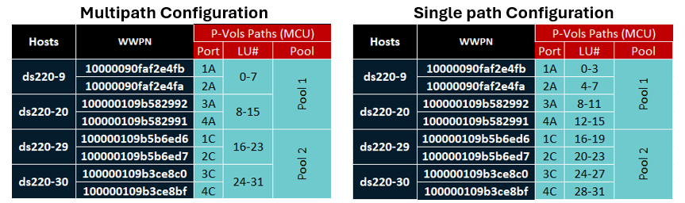

# Ansible Playbook: Create Multiple Data Volumes With Host Paths
# Overview
An enterprise-class configuration typically requires a large number of volumes, which must be mapped to the host as per requirements. The first playbook, _create_multiple_data_volumes.yml_ creates multiple volumes with specific parameters such as ADR, no-ADR, size, and naming. The second playbook, _create_host_groups_with_lun_paths.yml_ creates host groups and map volumes using both multipath and single path configurations based on users choice.

# Test Environment
A sample data volume specification for remote replication is shown in below table.

| Data Volumes | P-Vols (MCU) | S-Vols (RCU) |
|---|---|---|
| Number of Volumes | 32 | <- |
| Pool ID and LDEV ID | Pool1: LDEV 0-15, Pool2: LDEV 16-31 | <-|
| ADR | Disabled | <- |
| Size | 100 GB | <- |
| Name Prefix | Data_Vols | <-|
| DRS | false | <- |

Host path mapping for P-Vols can be configured as either multipath or single path, as shown below. In this setup, each host is connected through two HBA ports, and a host group is created on each port using the respective HBA WWPN. In a single-path configuration, different volumes are assigned to separate ports, whereas in a multipath configuration, the same range of volumes is mapped across multiple ports of the same host.



# Prerequisite
•	Establish Fibre Channel (FC) zoning between the server and storage system.

•	A standard variable file for storage credentials (“_ansible_vault_storage_var.yml_”) is created as shown below:

```
storage_serial: <primarySerialNumber>
storage_address: <StorageManagementAddress>
vault_storage_username: <username>
vault_storage_secret: <password>

secondary_storage_serial: <secondarySerialNumber>
secondary_storage_address: <StorageManagementAddress> 
vault_secondary_storage_username: <username>
vault_secondary_storage_secret: <password>
```
# Execution   
Create a “var.yml”, specify the MCU and RCU volumes, with each line representing the volumes assigned per pool. The file also defines Adaptive Data Reduction (ADR) options (compression, compression_deduplication, or disabled), default LDEV size, a naming prefix for volumes, and whether Data Reduction Share (DRS) is enabled or disabled for MCU and RCU volumes.

Update the var.yml file with the required parameters for LUN mapping, including the total volume range, multipathing option (Y/N), and port assignments. The “svolport” and “svolportlocal” parameters can be defined if S-Vols need to be mapped, and the “port_wwn_map” section specifies the HBA WWPNs for host group creation. Based on these options, the playbook will create the host groups and map the volumes accordingly. Volumes will be mapped according to above diagram, depending on the selected multipathing option (Y/N).

**Sample input for “var.yml” file:**
```
mcu_ldev:
  - "0-15,1"
  - "16-31,2"
rcu_ldev:
  - "0-15,1"
  - "16-31,2"
mcu_capacity_saving: "disabled"
rcu_capacity_saving: "disabled"
default_size: "100GB"
ldev_name_prefix: "Data_Vols"
mcu_DRS: "false"
rcu_DRS: "false"
totalvols_range: "0-31"
multipathing: "N" 
svolport: "CL1-B"  
#svolportlocal: "CL5-C" 
port_wwn_map:
  CL1-A: "10000090faf2e4fb,ds220-9"
  CL2-A: "10000090faf2e4fa,ds220-9"
  CL3-A: "100000109b582992,ds220-20"
  CL4-A: "100000109b582991,ds220-20"
  CL1-C: "100000109b5b6ed6,ds220-29"
  CL2-C: "100000109b5b6ed7,ds220-29"
  CL3-C: "100000109b3ce8c0,ds220-30"
  CL4-C: "100000109b3ce8bf,ds220-30"

```
Run the playbook with _ansible-playbook <playbook_name>_

This generates an output file as shown below.

**Sample output for LDEV creation:**
```
#cat /tmp/ldev_creation_report_20250913_142203.txt 
===================== LDEV Creation Report ==================

SN_"611004":
0: ["pool_id": 1, "provision_type": "CVS,HDP", "deduplication_compression_mode": "disabled", "capacity": "100.00GB" ]
1: ["pool_id": 1, "provision_type": "CVS,HDP", "deduplication_compression_mode": "disabled", "capacity": "100.00GB" ]
...
30: ["pool_id": 2, "provision_type": "CVS,HDP", "deduplication_compression_mode": "disabled", "capacity": "100.00GB" ]
31: ["pool_id": 2, "provision_type": "CVS,HDP", "deduplication_compression_mode": "disabled", "capacity": "100.00GB" ]

SN_"611014":
0: ["pool_id": 1, "provision_type": "CVS,HDP", "deduplication_compression_mode": "disabled", "capacity": "100.00GB" ]
1: ["pool_id": 1, "provision_type": "CVS,HDP", "deduplication_compression_mode": "disabled", "capacity": "100.00GB" ]
...
30: ["pool_id": 2, "provision_type": "CVS,HDP", "deduplication_compression_mode": "disabled", "capacity": "100.00GB" ]
31: ["pool_id": 2, "provision_type": "CVS,HDP", "deduplication_compression_mode": "disabled", "capacity": "100.00GB" ]
```

**Sample output for multipath:**
```
# cat /tmp/ldev_distribution_report_20250913_144445.txt
===================== Host Group Creation and LUN Mapping Report ==================

SN: 611014
==============
CL1-B [SvolPort]: [ 0, 1, 2, 3, 4, 5, 6, 7, 8, 9, 10, 11, 12, 13, 14, 15, 16, 17, 18, 19, 20, 21, 22, 23, 24, 25, 26, 27, 28, 29, 30, 31 ]

SN: 611004
==============
CL1-A [ds220-9, 10000090faf2e4fb]: ['0', '1', '2', '3', '4', '5', '6', '7']
CL2-A [ds220-9, 10000090faf2e4fa]: ['0', '1', '2', '3', '4', '5', '6', '7']
CL3-A [ds220-20, 100000109b582992]: ['8', '9', '10', '11', '12', '13', '14', '15']
CL4-A [ds220-20, 100000109b582991]: ['8', '9', '10', '11', '12', '13', '14', '15']
CL1-C [ds220-29, 100000109b5b6ed6]: ['16', '17', '18', '19', '20', '21', '22', '23']
CL2-C [ds220-29, 100000109b5b6ed7]: ['16', '17', '18', '19', '20', '21', '22', '23']
CL3-C [ds220-30, 100000109b3ce8c0]: ['24', '25', '26', '27', '28', '29', '30', '31']
CL4-C [ds220-30, 100000109b3ce8bf]: ['24', '25', '26', '27', '28', '29', '30', '31']
```
**Sample output for single path:**
```
#cat /tmp/ldev_distribution_report_20250913_150117.txt
===================== Host Group Creation and LUN Mapping Report ==================

SN: 611014
==============
CL1-B [SvolPort]: [ 0, 1, 2, 3, 4, 5, 6, 7, 8, 9, 10, 11, 12, 13, 14, 15, 16, 17, 18, 19, 20, 21, 22, 23, 24, 25, 26, 27, 28, 29, 30, 31 ]

SN: 611004
==============
CL1-A [ds220-9, 10000090faf2e4fb]: ['0', '1', '2', '3']
CL2-A [ds220-9, 10000090faf2e4fa]: ['4', '5', '6', '7']
CL3-A [ds220-20, 100000109b582992]: ['8', '9', '10', '11']
CL4-A [ds220-20, 100000109b582991]: ['12', '13', '14', '15']
CL1-C [ds220-29, 100000109b5b6ed6]: ['16', '17', '18', '19']
CL2-C [ds220-29, 100000109b5b6ed7]: ['20', '21', '22', '23']
CL3-C [ds220-30, 100000109b3ce8c0]: ['24', '25', '26', '27']
CL4-C [ds220-30, 100000109b3ce8bf]: ['28', '29', '30', '31']
```

