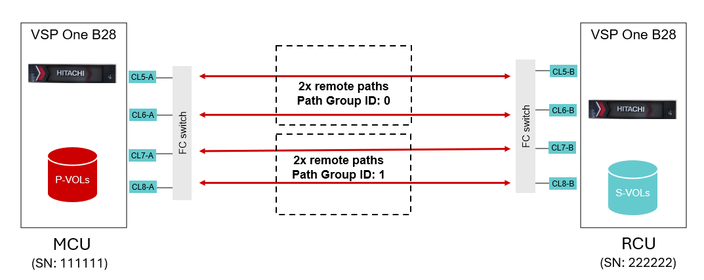

# Ansible Playbook: Configure Multiple Remote Paths
# Overview
This Ansible Playbook creates multiple remote paths based on user input in a variable file. Users can provide inputs such as local and remote port pairs and remote path groups as variables, which are then dynamically applied during execution.


# Test Environment
Remote path connections are essential for Hitachi remote replication products such as Global-Active Device (GAD), Universal Replicator (UR), and True Copy (TC). Below diagram depicts a standard remote path configuration for GAD/UR or TC.

In the above diagram, four remote paths (two paths in each path group) are shown. 

# Prerequisite
•	Establish Fibre Channel (FC) zoning between the two storage systems.

•	Ensure that Ansible is already configured and the local and remote VSP storage systems are registered with each other. 

•	A standard variable file for storage credentials (“_ansible_vault_storage_var.yml_”) is created as shown below:

```
storage_serial: <primarySerialNumber>
storage_address: <StorageManagementAddress>
vault_storage_username: <username>
vault_storage_secret: <password>

secondary_storage_serial: <secondarySerialNumber>
secondary_storage_address: <StorageManagementAddress> 
vault_secondary_storage_username: <username>
vault_secondary_storage_secret: <password>
```
# Execution

Create a “_var.yml_” file that defines the MCU and RCU port mappings for each remote connection. In the above diagram, for example, CL5-A from MCU connects to CL5-B of RCU in Path Group ID 0. List each pair of ports for a given path group on the same line, separated by commas. For additional path groups, add new lines as shown in the sample variable file content below. Repeat the same process for RCU paths.

**Sample Input for “var.yml” file:**
```
mcu_remote_paths:
  - "CL5-A CL5-B,CL6-A CL6-B,0"
  - "CL7-A CL7-B,CL8-A CL8-B,1"
rcu_remote_paths:
  - "CL5-B CL5-A,CL6-B CL6-A,0"
  - "CL7-B CL7-A,CL8-B CL8-A,1"
```
Note: This playbook works with either MCU, RCU, or both path entries in “var.yml” file.

Run the playbook with _ansible-playbook <playbook_name>_
This generates an output file as shown below.

**Sample Output**
```
#cat /tmp/remote_path_creation_report_111111_222222_20250818_044954.txt
===================== Remote Path Creation Report ==================

remote paths: 111111->222222
id: 0
  paths:
    - CL5-A -> CL5-B
    - CL6-A -> CL6-B
id: 1
  paths:
    - CL7-A -> CL7-B
    - CL8-A -> CL8-B
remote paths: 222222->111111
id: 0
  paths:
    - CL5-B -> CL5-A
    - CL6-B -> CL6-A
id: 1
  paths:
    - CL7-B -> CL7-A
    - CL8-B -> CL8-A
```
